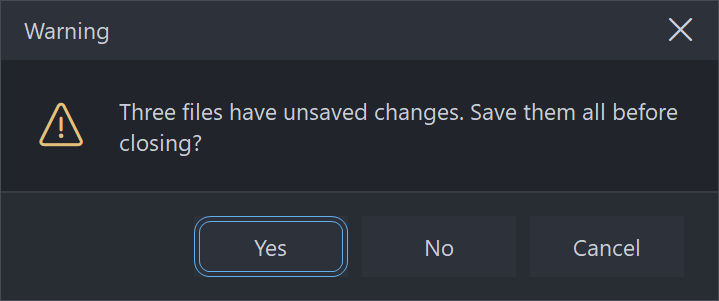

# CMessageBox

An owner-drawn modal message box for FreeBASIC Win32 applications: an owner-drawn caption band
with a title and a close X, a body holding an optional icon and a wrapped left-justified message,
and a footer holding one to three buttons.

It is the control you reach for when `MessageBox()` would do the job but looks like it came from a
different application than the rest of yours. Every pixel is drawn by this control — the caption
band, the title, the close X, the icon, the message and the chrome — so nothing about its
appearance depends on the visual style the user happens to be running, and every colour it paints
is one you can set. The footer buttons are **CButton**s: real child windows that paint themselves
and are reached with Tab.

`CMessageBox_DoModal` **blocks**. It sizes and centres the box, disables the parent, runs its own
nested message loop, destroys the box, and returns the id of whatever dismissed it. Because it
owns that loop it also owns `IsDialogMessage`, which means this control adds **nothing at all** to
your message pump.

---

## What it looks like



An actual modal box, raised from the demo and captured while its nested message loop was running. The caption band, its title and the close X are all owner-drawn; below them an icon and a wrapped, left-justified message, then one to three `CButton`s with the default carrying the accent border. These are the shipped **dark** defaults; the light set matching the reference screenshot lives in the demo.

---

## Requirements

**Files to copy into your project:**

| File | Purpose |
|---|---|
| `CMessageBox.bi` | Declarations — types, callbacks, constants, function prototypes |
| `CMessageBox.inc` | Implementation |
| `CButton.bi` | The footer buttons are CButtons |
| `CButton.inc` | Its implementation |
| `CBufferPaint.bi` | The flicker-free drawing surface the control paints through |
| `CBufferPaint.inc` | Its implementation |

**Use the `CBufferPaint` copy shipped in this repo.** The box draws its wrapped message with
`CBufferPaint.PaintTextEx`. `PaintText` forces `DT_VCENTER or DT_SINGLELINE`, which cannot coexist
with `DT_WORDBREAK`, so it structurally cannot draw a wrapped message — an older copy of
`CBufferPaint` without `PaintTextEx` will not build against this control.

**AfxNova is required.** The control is built on `CWindow`, and `CBufferPaint` draws through
`AfxNova\CGdiPlus.inc`. Sources include AfxNova relative to the workspace root
(`#include once "AfxNova\CWindow.inc"`), so builds need the workspace root on the include path:

```bash
fbc64.exe -i "C:\dev" main.bas
```

**Include order.** Each `.inc` pulls in its own `.bi`, and `CMessageBox.bi` pulls in both
`CBufferPaint.bi` and `CButton.bi`. The three implementation files are included in this order,
after AfxNova and after `using AfxNova`:

```freebasic
#include once "windows.bi"
#include once "AfxNova\CWindow.inc"
#include once "AfxNova\AfxStr.inc"
#include once "AfxNova\AfxGdiplus.inc"

using AfxNova

#include once "CBufferPaint.inc"
#include once "CButton.inc"
#include once "CMessageBox.inc"
```

**GDI+ must be running before the first repaint and must outlive the last one.** The control
renders its geometry through GDI+, so bracket your message loop:

```freebasic
dim as ULONG_PTR gdipToken = AfxGdipInit()
' ... create windows, run the message loop ...
AfxGdipShutdown( gdipToken )
```

`AfxGdipShutdown` must come after every window is destroyed, because each repaint builds and tears
down a `CBufferPaint`.

**Never name an identifier `ok`.** GDI+ defines `Ok = 0` as a `Status` enum value in namespace
`AfxNova`, and hosts customarily say `using AfxNova`. An existing variable, parameter or function
called `ok` becomes a duplicate definition the moment you adopt these files. Use `bOK` instead.

**There is no pump obligation.** There is no `CMessageBox_FilterMessage` and nothing to add to your
`GetMessage` loop — not for Tab, not for Escape, not for the focus ring. `CMessageBox_DoModal` runs
its own nested loop and calls `IsDialogMessage` itself, so everything keyboard-related is already
handled inside the blocking call. If you have adopted controls that drop a floating window into
your host's pump and therefore require a filter, this one is the exception: it takes the pump over
rather than borrowing it.

**You supply the fonts, and you own them.** The control never creates a font. Four handles are
settable and all four are borrowed — keep them alive while the box is up and destroy them yourself:

| Setter | Font |
|---|---|
| `CMessageBox_SetFont` | The message. This is also the **measuring** font, so it decides the wrap and therefore the box's height. |
| `CMessageBox_SetCaptionFont` | The title. Unset falls back to the message font. |
| `CMessageBox_SetGlyphFont` | The **message icon** — an icon face at a size that fills the ~32px icon cell. |
| `CMessageBox_SetCloseGlyphFont` | The **close X** — the same icon face at ~10px, because it is caption chrome. |

The last two are separate on purpose: one font cannot serve a 32px icon and a 10px caption glyph,
and since the control creates no fonts it cannot derive the smaller one for you. Leave the glyph
font unset and the icon codepoints render as missing-glyph boxes; leave the close font unset and
the X is drawn in the icon font, comically large.

---

## Quick start

```freebasic
' Create it. The box is a hidden, zero-sized popup owned by hWndParent.
dim as HWND hBox = CMessageBox_Create( hWndParent )

' The fonts. All four stay yours; the control never creates or destroys one.
CMessageBox_SetFont( hBox, ghFont(GUIFONT_10) )
CMessageBox_SetCaptionFont( hBox, ghFont(GUIFONT_10) )
CMessageBox_SetGlyphFont( hBox, ghFont(SYMBOLFONT_20) )        ' the ~32px message icon
CMessageBox_SetCloseGlyphFont( hBox, ghFont(SYMBOLFONT_10) )   ' the ~10px close X

' The content.
CMessageBox_SetCaption( hBox, "Warning" )
CMessageBox_SetText( hBox, "This buffer contains unsaved edits. Do you want to save it?" )
CMessageBox_SetIconKind( hBox, MBX_ICON_WARNING )

' Three buttons, plus a matching default button and cancel id.
CMessageBox_AddPreset( hBox, MBX_BTN_SAVE_DONTSAVE_CANCEL )

' THIS BLOCKS. It measures, sizes, centres, disables the parent, shows the box, runs its own
' message loop, re-enables the parent, destroys the box, and returns the dismissing id.
' hBox is dead after this line.
select case CMessageBox_DoModal( hBox )
case IDYES
    SaveDocument()
case IDNO
    ' discard
case IDCANCEL
    ' Cancel, Escape, the close X and Alt+F4 all arrive here
end select
```

Or, for the plainest case, one call that creates, configures, shows and returns:

```freebasic
if CMessageBox_Show( hWndParent, "Delete this file?", "Confirm", _
                     MBX_ICON_QUESTION, MBX_BTN_YESNO ) = IDYES then
    DeleteTheFile()
end if
```

`CMessageBox_Show` sets **no fonts**, so its icon comes out as a missing-glyph box. Use the long
form whenever you want icons.

That is the whole minimum. Everything below is refinement.

---

## Concepts

### The handle is a real HWND

`CMessageBox_Create` returns an ordinary window handle, and every `CMessageBox_*` function takes
it. It is a `WS_POPUP` top-level window — not a child — owned by the `hWndParent` you passed, with
`WS_CLIPSIBLINGS`, `WS_CLIPCHILDREN` and `WS_EX_CONTROLPARENT`. It carries no system caption,
because the caption band, its title and its X are all drawn by this control; that is the only way
your colours and your font reach them. `CS_DROPSHADOW` is added so the box reads as floating above
the parent rather than painted onto it.

`hWndParent` may be 0. Nothing is disabled and the box centres on the monitor holding the cursor.

### It is created hidden and zero-sized

Nothing is shown by `CMessageBox_Create`. `CMessageBox_DoModal` is what measures the box, sizes it
to its ideal size, centres it and shows it — so you configure a box completely before it is ever
seen, and you never size it yourself.

### The modal loop

`CMessageBox_DoModal` does all of this, in this order:

1. Measures the box and sizes the window to `CMessageBox_GetIdealSize`.
2. Centres it — on the parent's **window** rect, or with no parent on the monitor holding the
   cursor — then clamps it into that monitor's work area.
3. Sounds the `MessageBeep` for the icon kind, unless `CMessageBox_SetBeep( ..., false )`.
4. Disables the parent, **then** shows the box, so there is never a frame in which both are live.
5. Gives a button the focus (see *Which button owns Enter*), because `IsDialogMessage` ignores Tab
   until a descendant already has it.
6. Runs a nested `GetMessage` loop with its own `IsDialogMessage`.
7. Re-enables and re-activates the parent, **then** destroys the box. Destroying an owned window
   while its owner is still disabled hands activation to another application.
8. Returns the dismissing id.

**The handle is dead when `DoModal` returns.** A box that is created and then abandoned without
`DoModal` is yours to `DestroyWindow`.

**`WM_QUIT` is re-posted, not consumed.** If the host shuts down while a box is up, the nested loop
puts the quit message back before exiting, so your outer pump still sees it.

**Nested boxes work.** A second `DoModal` raised from inside a callback of the first puts a second
loop on the stack. The inner box ends its own loop without ending the outer one, and the outermost
parent stays disabled throughout.

### It is a container, and its buttons are the tabstops

The box window is **not** focusable. It has no `WS_TABSTOP` and never calls `SetFocus` on itself.
The tabstops are the child CButtons, which is why the box carries `WS_EX_CONTROLPARENT` and the
buttons do not: the dialog manager must descend into the box to find them, and must treat each
button as a leaf. Tab and Shift+Tab walk the buttons in the order they were added; Space and Enter
activate the focused one.

### Three bands tile the client exactly

| Band | Height |
|---|---|
| Caption | `captionHeight` — **declared**, never measured |
| Body | whatever is left between the other two |
| Footer | `2 × footerPadY + tallest button height`, or **0** when there are no buttons |

All three span the full client width. The caption band holds the title on the left and the close X
in a `closeWidth`-wide cell hard against the right edge; the title's span stops short of the X, and
a long title ellipsizes into it rather than sliding underneath. The band does not collapse just
because the title is empty — its height is declared, so an untitled box still has a caption band
and still has an X.

### How the box is sized

```
  iconBlock    = hasIcon ? iconWidth + iconGap : 0
  availW       = maxWidth - 2*bodyPadX - iconBlock          the WRAP width (floored at 40)
  textW/textH  = DrawTextW( DT_CALCRECT or DT_WORDBREAK ) at availW

  btnW(i)      = max( button's own ideal width , buttonMinWidth )
  buttonH      = the TALLEST button's ideal height
  footerH      = buttonCount ? 2*footerPadY + buttonH : 0
  bodyH        = 2*bodyPadY + max( textH , hasIcon ? iconHeight : 0 )

  idealW       = max( 2*bodyPadX   + iconBlock + textW ,
                      2*footerPadX + sum(btnW) + (n-1)*buttonGap ,
                      captionPadX  + captionTextW + closeWidth ,
                      minWidth )
  idealH       = captionHeight + bodyH + footerH
```

Three things follow from that, and all three surprise people:

**`SetMaxWidth` constrains the text wrap, not the window.** It is one term of a `max()`, not a
clamp. Three long-captioned buttons legitimately make the box wider than the wrap width, and a long
title does too. What the maximum limits is how far a line of the message runs before it wraps.

**The box shrinks to fit.** `DT_CALCRECT` reports the width the wrapped text actually used, not the
width it was offered, so *"Delete this file?"* produces a small box rather than one padded out to
the maximum. `SetMinWidth` is the floor that stops it becoming silly.

**The title contributes a width floor only.** The caption band's height is declared, so a title
taller than the band clips rather than growing the box.

### Icon and text share a vertical centre

Both are centred on the taller of the two, so a one-line message sits level with a 32px icon
instead of clinging to its top edge, and a long message keeps the icon beside its first lines
rather than leaving it floating at the top of a tall block.

`MBX_ICON_NONE` is a real layout state, not "no artwork available": the icon cell and its gap are
not charged at all, so the text starts at the body padding and the box is narrower.

The icon cell is a **layout** rect. The control never measures the icon font, so a glyph too large
for the cell clips instead of resizing the box — set `CMessageBox_SetIconSize` to match your font,
or size the font to the cell.

### The buttons share one height but not one width

A row of buttons must sit on one baseline or it reads as broken, so every button is given the
tallest one's ideal height. Widths are each button's own ideal width, floored at
`CMessageBox_SetButtonMinWidth` — which is what Windows does, and why *Save / Don't Save / Cancel*
are three different widths.

They are right-aligned, laid out from the right edge inwards, and appear left to right in the order
you added them. That order is also the tab order.

### The dismissal contract

Every route out of the box goes through one place, so nothing can end the loop without also setting
a result:

| Route | `DoModal` returns |
|---|---|
| A footer button is clicked, or activated with Space/Enter | **that button's id** — the value you passed to `CMessageBox_AddButton` |
| Escape | the cancel id |
| The close X | the cancel id |
| Alt+F4, or any `WM_CLOSE` you post yourself | the cancel id |
| The window is destroyed out from under the loop | 0 |

**The cancel id, when you have not set one, is the LAST button's id.** That convention was chosen
because the last button is Cancel or No in every preset — it is not a law, and it is the one thing
in this control that can hurt you. See *Behaviour and limits*.

The button ids are entirely yours. They are never used as Win32 command ids; the buttons carry
separate internal control ids, so a host id of 0 or 1 cannot collide with anything the dialog
manager cares about.

### Which button owns Enter, and which one has the focus

`CMessageBox_SetDefaultButton` does three things at once: it paints that button's accent border, it
claims Enter box-wide, and it takes the initial focus.

Enter fires the default button **only when no button has the focus**. A focused button claims Enter
for itself, so once the user has tabbed to Cancel, Enter presses Cancel — not the default. That is
what you want, and it is the natural thing to get wrong.

Initial focus resolves in this order:

```
  an explicit SetFocusButton   >   the default button   >   the first button
```

**Order matters.** `SetDefaultButton` takes the focus with it, so if you want *Delete* to be the
default while *Cancel* has the focus ring, call `SetFocusButton` **after** `SetDefaultButton`.

### Dragging, and the close X

The whole caption band answers `HTCAPTION`, so `DefWindowProc` moves the window for you — that is
the entire drag implementation. The close X is excluded from it, or it would be both undraggable
and unclickable.

The X is the one thing on the box that takes mouse capture, because it has an ordinary press/cancel
gesture: press it, slide off, release, and nothing happens. Its idle background defaults equal to
the caption's, so it is invisible until the cursor reaches it, at which point it turns the Windows
close-red. The footer buttons take their own capture; the box neither knows nor cares.

### Pixels, and who scales them

Only the creation-time defaults are DPI-scaled for you:

| Setting | Default | DPI-scaled at create? |
|---|---:|---|
| Caption height | 34 | Yes |
| Caption left padding | 14 | Yes |
| Close-button width | 44 | Yes |
| Body padding X / Y | 20 / 20 | Yes |
| Footer padding X / Y | 20 / 14 | Yes |
| Icon width / height | 32 / 32 | Yes |
| Icon gap | 16 | Yes |
| Button gap | 8 | Yes |
| Button minimum width | 88 | Yes |
| Maximum (wrap) width | 420 | Yes |
| Minimum width | 300 | Yes |
| Border thickness | 1 | **No** |
| Divider thickness | 1 | **No** |

Every setter afterwards takes raw pixels and expects **you** to scale — typically
`pWindow->ScaleX(...)` / `ScaleY(...)`. The two thickness values should not be scaled at all: a
hairline should stay a hairline at any DPI.

### Layout is lazy

A setter marks the layout stale and asks for a repaint; the next paint — or any size query, rect
query, or `DoModal` — recomputes it in one measuring pass. There is no begin-update / end-update
pair to remember, and configuring a box with fifteen calls in a row costs one measuring pass, not
fifteen.

Setters that cannot change a measurement repaint without re-laying out at all: `SetIconColor`,
`SetBorderThickness`, `SetGlyphFont` and `SetCloseGlyphFont`.

### Lifetime

`CMessageBox_DoModal` destroys the box before returning. The child buttons are ordinary child
windows and go with it; each frees its own state. Your fonts are left alone. A box created and then
abandoned without `DoModal` must be destroyed by you with `DestroyWindow`.

---

## Behaviour and limits

> **The cancel id defaults to the LAST button's id.** Escape, the close X and Alt+F4 all answer it.
> That is correct for every preset, where the last button is Cancel or No — but a box whose last
> button is **destructive must call `CMessageBox_SetCancelID` explicitly**, or pressing Escape
> performs the destructive action. With no buttons at all there is nothing to name, and the answer
> is 0.

Firm properties of the control, not settings:

- **`CMessageBox_DoModal` blocks**, and the handle is dead when it returns. Do not touch `hMsgBox`
  afterwards.
- **Three buttons maximum.** `CMessageBox_AddButton` returns 0 once the box holds
  `CMESSAGEBOX_MAXBUTTONS`. A question that needs a fourth answer wants a real dialog.
- **`CMessageBox_AddPreset` is additive.** It appends to whatever is already there and then sets
  the default button and the cancel id. Calling it on a box that already has buttons is a host
  error; the control does not police it.
- **There is no disabled mood anywhere.** A message box is modal and everything on it is live by
  definition — a disabled button on a box the user cannot leave would be a trap. The colour struct
  carries no disabled fields.
- **The box is not resizable.** There is no thick frame and no size grip, and `DoModal` always
  sizes it to its ideal size. If you resize it yourself, rects are computed honestly rather than
  squeezed: the text and title spans collapse to empty rather than going negative, and the buttons
  keep their sizes and run off the left edge.
- **No tooltips.** There is no tooltip window and no tooltip callback anywhere on the box. The
  footer buttons have their own tooltip API, reachable through `CMessageBox_GetButtonHandle`.
- **No `HICON` support.** The icon is a glyph string drawn in a font you supply — by default a
  Segoe Fluent Icons / Segoe MDL2 Assets codepoint. Ship a different icon font and remap the
  `CMESSAGEBOX_GLYPH_*` values, or override per box with `CMessageBox_SetGlyph`.
- **No Ctrl+C.** The real Win32 `MessageBox` copies its text to the clipboard; this one does not.
  The message is drawn with `DrawTextW` and there is no text object behind it.
- **No text selection**, for the same reason.
- **No rounded corners.** Square, so that adopting the control does not force a `dwmapi` link on
  every host.
- **`CS_DBLCLKS` is deliberately off.** The only double-clickable thing on the box is the X, and a
  rapid second click there is a legitimate second click on a window that may already be gone.
- **The caption is not the window text.** `CMessageBox_SetCaption` does not alias `WM_SETTEXT`, so
  `GetWindowText` on the box returns nothing useful.
- **Leaving the glyph font unset draws missing-glyph boxes**, not nothing. So does
  `CMessageBox_Show`, which sets no fonts at all.
- **`CMessageBox_SetIconColor` cannot be undone.** It latches an override, and there is no way to
  hand the colour decision back to the icon kind. `CMessageBox_SetGlyph( ..., "" )` *does* clear
  the glyph override.
- **Out-of-range values are ignored**, leaving the current setting in place: an icon kind outside
  the five constants, a negative padding, gap, thickness, height or width, a maximum width below 1,
  a button index outside the current button count.
- **The footer divider has no setter.** Its thickness is fixed at 1 pixel and never scaled; its
  colour is `DividerColor` in the colour struct.

---

## API reference

### Creation and showing

| Function | Description |
|---|---|
| `CMessageBox_Create( hWndParent ) as HWND` | Creates a hidden, zero-sized `WS_POPUP` box owned by `hWndParent`, and returns its window handle. `hWndParent` may be 0. Configure the box, then call `CMessageBox_DoModal`. |
| `CMessageBox_DoModal( hMsgBox ) as long` | **Blocks.** Measures, sizes, centres, beeps, disables the parent, shows the box, runs its own nested message loop, re-enables and re-activates the parent, destroys the box, and returns the dismissing id. **The handle is dead afterwards.** A `WM_QUIT` arriving during the loop is re-posted so your outer pump still sees it. Safe to call from inside another box's callback — the loops nest. |
| `CMessageBox_Show( hWndParent, Text, Caption, nIconKind, nPreset ) as long` | Create + configure + `DoModal` in one call, for the plainest case. `nIconKind` defaults to `MBX_ICON_NONE` and `nPreset` to `MBX_BTN_OK`. **Sets no fonts**, so the box measures and draws in the stock GUI font and any icon renders as a missing glyph. Everything it does is reachable through the long form. |

### Content

All silent, and all lazy — a burst of them costs one measuring pass.

| Function | Description |
|---|---|
| `CMessageBox_GetCaption( hMsgBox ) as DWSTRING` | The title drawn in the caption band. |
| `CMessageBox_SetCaption( hMsgBox, Text )` | Sets it. `""` draws an empty band; it does not remove the band. A long title ellipsizes into its own span rather than sliding under the close X. Contributes a **width floor** to the box, so this can change its size. |
| `CMessageBox_GetText( hMsgBox ) as DWSTRING` | The message. |
| `CMessageBox_SetText( hMsgBox, Text )` | Sets it. Wrapped at the maximum width and left-justified; embedded CRLF is honoured as well as the automatic wrap, and tabs are expanded. This is what the box's height is measured from. |
| `CMessageBox_GetIconKind( hMsgBox ) as long` | `MBX_ICON_NONE`, `_INFO`, `_WARNING`, `_ERROR` or `_QUESTION`. |
| `CMessageBox_SetIconKind( hMsgBox, nKind )` | Picks the glyph **and** the icon colour, and selects which `MessageBeep` sounds. Values outside the five constants are ignored. `MBX_ICON_NONE` removes the icon cell and its gap from the layout entirely. |
| `CMessageBox_SetGlyph( hMsgBox, Glyph )` | Overrides the glyph the kind resolved to. **A glyph override turns the icon on even when the kind is `MBX_ICON_NONE`** — setting a glyph is an unambiguous request for one. Pass `""` to clear the override and hand the decision back to the kind. |
| `CMessageBox_SetIconColor( hMsgBox, clr )` | Overrides the colour the kind resolved to, and repaints without re-laying-out. **Latching: there is no way to clear it.** |
| `CMessageBox_SetBeep( hMsgBox, bBeep )` | `false` suppresses the `MessageBeep` that otherwise fires for the icon kind just before the box is shown. Those sounds are a user preference, so suppressing one overrides the user rather than removing noise. Default `true`. |

### Buttons

| Function | Description |
|---|---|
| `CMessageBox_AddButton( hMsgBox, Text, id ) as HWND` | Appends a button and returns its `HWND`, so you can reach past this API for anything the box does not expose — a glyph on one button, its own colours for a destructive choice. **`id` is your value and is exactly what `DoModal` returns**; it never enters a command stream. Returns **0** when the box already holds `CMESSAGEBOX_MAXBUTTONS` (3). The box's current message font, glyph font and button colours are pushed into the new button, so add-then-configure and configure-then-add give the same result. |
| `CMessageBox_AddPreset( hMsgBox, nPreset )` | Adds a whole ready-made set **and** sets the default button and the cancel id to match. **Additive** — calling it on a box that already has buttons is a host error. The captions are English literals; a localised host uses `AddButton` directly. |
| `CMessageBox_GetButtonCount( hMsgBox ) as long` | How many buttons the footer holds, 0 to 3. |
| `CMessageBox_GetButtonHandle( hMsgBox, idx ) as HWND` | The `HWND` of button `idx`, or 0 if the index is out of range. |
| `CMessageBox_GetDefaultButton( hMsgBox ) as long` | The default button's index, or -1 when there is none. |
| `CMessageBox_SetDefaultButton( hMsgBox, idx )` | Paints the accent border on that button, claims Enter box-wide, **and** takes the initial focus. `-1` clears the default. Any previous default is cleared first, so there is never more than one accent border. Indices outside `-1 .. count-1` are ignored. **Call `SetFocusButton` after this**, not before, if the two are to differ. |
| `CMessageBox_GetFocusButton( hMsgBox ) as long` | The index that **will actually** take focus when the box opens — the resolved answer, not the stored one: an explicit focus button, else the default, else the first. `-1` when there are no buttons. |
| `CMessageBox_SetFocusButton( hMsgBox, idx )` | Names the button that takes the initial focus, overriding the default button. `-1` and out-of-range indices are ignored, so there is no way to un-set it once set. |

### Dismissal

| Function | Description |
|---|---|
| `CMessageBox_GetCancelID( hMsgBox ) as long` | What Escape, the close X and Alt+F4 **will** return — the resolved answer, so it reports the last button's id when no cancel id has been set, and 0 when there are no buttons. |
| `CMessageBox_SetCancelID( hMsgBox, id )` | Sets it explicitly. **Mandatory when the last button is destructive**, because that is what the unset default resolves to. |

### Geometry and layout

All setters take **raw pixels**; you do the DPI scaling. Each marks the layout stale and requests a
repaint, except where noted.

| Function | Description |
|---|---|
| `CMessageBox_SetMaxWidth( hMsgBox, nMaxWidth )` | The **wrap** width, not a cap on the window: it limits how far a line of the message runs before wrapping, and the box is still made wider when the buttons or the title need it. Values below 1 are ignored. The wrap width left after padding and the icon cell is floored at 40 pixels, so an absurd maximum yields a narrow column rather than undefined behaviour. |
| `CMessageBox_SetMinWidth( hMsgBox, nMinWidth )` | A floor on the whole box. Negative values ignored. |
| `CMessageBox_SetCaptionHeight( hMsgBox, nHeight )` | The caption band's height. **Declared, never measured** — a title too tall for it clips. Negative values ignored. |
| `CMessageBox_SetBodyPadding( hMsgBox, nX, nY )` | Padding inside the body band, around the icon and the message. Either value negative and the call is ignored. |
| `CMessageBox_SetFooterPadding( hMsgBox, nX, nY )` | Padding inside the footer band. `nY` sets the footer's height together with the tallest button. Either value negative and the call is ignored. |
| `CMessageBox_SetIconSize( hMsgBox, nIconWidth, nIconHeight )` | The icon **cell**. The glyph is never measured, so size this to the icon font you set. Either value negative and the call is ignored. |
| `CMessageBox_SetIconGap( hMsgBox, nGap )` | The gap between the icon cell and the message. Charged only when there is an icon. Negative ignored. |
| `CMessageBox_SetButtonGap( hMsgBox, nGap )` | The gap between adjacent footer buttons. Negative ignored. |
| `CMessageBox_SetButtonMinWidth( hMsgBox, nMinWidth )` | The floor each button's own ideal width is raised to. Negative ignored. |
| `CMessageBox_SetBorderThickness( hMsgBox, nThickness )` | The outline around the whole box; **0 means no border**. Drawn inside the client and last of all, so it takes no space from the layout — this repaints without re-measuring. Do not DPI-scale it. Negative ignored. |
| `CMessageBox_GetIdealSize( hMsgBox, byref nBoxWidth, byref nBoxHeight )` | The measured size of the whole box. Forces a pending layout, and is **valid before the window has ever been sized** — which is load-bearing, because `DoModal` sizes the window from it. |
| `CMessageBox_GetCaptionRect( hMsgBox, byref rc ) as boolean` | The caption band, full width. |
| `CMessageBox_GetCloseRect( hMsgBox, byref rc ) as boolean` | The close X's cell. |
| `CMessageBox_GetBodyRect( hMsgBox, byref rc ) as boolean` | Between the caption and the footer, full width. |
| `CMessageBox_GetIconRect( hMsgBox, byref rc ) as boolean` | The icon cell. Empty when there is no icon. |
| `CMessageBox_GetTextRect( hMsgBox, byref rc ) as boolean` | The **wrap box**, not the ink: its width is the wrap width and its height is the measured height of the wrapped text. |
| `CMessageBox_GetFooterRect( hMsgBox, byref rc ) as boolean` | The button band, full width. Empty when there are no buttons. |
| `CMessageBox_GetButtonRect( hMsgBox, idx, byref rc ) as boolean` | Button `idx`'s rectangle. Returns FALSE for an index outside the current button count. |

Every rect query forces a pending layout first, so results are always current, and all are in
client coordinates. Each returns **FALSE** — leaving `rc` empty — when the box has no client area
yet, which is the case between `CMessageBox_Create` and `CMessageBox_DoModal`. An absent part
answers **TRUE** with an empty rect: empty is the honest answer.

### Fonts

All four handles are borrowed. Keep them alive and destroy them yourself.

| Function | Description |
|---|---|
| `CMessageBox_GetFont( hMsgBox ) as HFONT` | The message font, or 0 if unset. |
| `CMessageBox_SetFont( hMsgBox, hTextFont )` | The message font, and the **measuring** font — changing it re-wraps the text and so changes the box's height. Also pushed into every existing button and every button added later, whose own ideal widths then change too. Unset, the box measures and draws with the stock GUI font. |
| `CMessageBox_GetCaptionFont( hMsgBox ) as HFONT` | The title font, or 0 if unset. |
| `CMessageBox_SetCaptionFont( hMsgBox, hCaptionFont )` | The title's font. Unset falls back to the message font. Re-measures, because the title contributes a width floor. |
| `CMessageBox_GetGlyphFont( hMsgBox ) as HFONT` | The message-icon font, or 0 if unset. |
| `CMessageBox_SetGlyphFont( hMsgBox, hGlyphFont )` | The **message icon's** font — normally an icon face such as Segoe Fluent Icons, at a size that fills the ~32px icon cell. Also pushed into the buttons as their glyph font. Repaints without re-laying-out, because the icon cell is declared rather than measured. Unset falls back to the message font, which draws the codepoints as missing-glyph boxes — so in practice a host that wants an icon must set this. |
| `CMessageBox_GetCloseGlyphFont( hMsgBox ) as HFONT` | The close-X font, or 0 if unset. |
| `CMessageBox_SetCloseGlyphFont( hMsgBox, hCloseFont )` | The **close X's** font, separate from the icon's because the icon cell is ~32px and the X is a ~10px caption glyph. Not pushed into the buttons — it is caption chrome, not content. Repaints only. Unset falls back to the icon font, which draws a comically large X if that font was sized for the icon. |

### Appearance

| Function | Description |
|---|---|
| `CMessageBox_GetColors( hMsgBox, pColors as MBX_COLORS ptr )` | Fills your struct with the box's current colours. |
| `CMessageBox_SetColors( hMsgBox, pColors as MBX_COLORS ptr )` | Copies the whole struct in and repaints. |
| `CMessageBox_SetButtonColors( hMsgBox, pColors as CBUTTON_COLORS ptr )` | Pushes a `CBUTTON_COLORS` set into every button that exists **now** and stores it for every button added **later**, so the order of this call and `AddButton` does not matter. Without it, a re-coloured box keeps the buttons' own defaults. |
| `CMessageBox_ResolveGlyph( nKind ) as DWSTRING` | The glyph an `MBX_ICON_*` kind draws — a one-character string holding the matching `CMESSAGEBOX_GLYPH_*` codepoint, or `""` for `MBX_ICON_NONE` or any value outside the five constants. A **pure function**: it takes no box handle and touches no global, so you can call it for any kind at any time. Note it does **not** fold in a `CMessageBox_SetGlyph` override — it answers exactly one question, "what does this kind map to". |
| `CMessageBox_ResolveIconColor( nKind, pColors as MBX_COLORS ptr ) as COLORREF` | The colour that kind draws in, read out of the `MBX_COLORS` you hand it: `IconColorInfo`, `IconColorWarning`, `IconColorError` or `IconColorQuestion`. Also pure. `MBX_ICON_NONE` and out-of-range values answer `pColors->ForeColor` — the body's own foreground, so that a careless painter cannot draw with a sentinel. Returns 0 if `pColors` is null. Like the above, it ignores a `CMessageBox_SetIconColor` override. |
| `CMessageBox_CountRenderedTones( hMsgBox, nPart ) as long` | Renders the box offscreen with its **current** painter and returns how many distinct colours land inside one `MBX_PART_*` rect, capped at 64. A diagnostic for hosts that install a paint callback — see *Callbacks*. Returns 0 if the box has no client area yet, so size the window first (`SetWindowPos` to `CMessageBox_GetIdealSize`). |

The two resolvers are there for a host writing its own paint callback that wants to draw an icon
of its own while still matching the kind, or that wants to know a kind's glyph and colour without
building a box first. Inside a paint callback you rarely need either: `MBX_PAINTINFO` already
carries `wszGlyph` and `clrIcon`, and those **do** have the overrides folded in.

To change one colour, read-modify-write:

```freebasic
dim as MBX_COLORS clrs
CMessageBox_GetColors( hBox, @clrs )
clrs.BackColor        = BGR(255,255,255)
clrs.CaptionBackColor = BGR(243,243,243)
CMessageBox_SetColors( hBox, @clrs )
```

### Callback registration

| Function | Description |
|---|---|
| `CMessageBox_SetPaintCallback( hMsgBox, usersub )` | Installs a renderer that draws the whole box **instead of** the built-in painter. The child buttons still paint themselves. Repaints. |
| `CMessageBox_SetMessageCallback( hMsgBox, userfunc )` | Installs an observer for the box's own messages. |

Both are optional and independent.

---

## Colors

The colour surface is one flat struct, `MBX_COLORS`, with seventeen `COLORREF` fields. Every field
ships with a usable default, so a box you never call `CMessageBox_SetColors` on still looks right.

**The defaults are dark.** They are inherited from the button palette rather than matched to a
light system theme, so an untouched box looks like a dark-themed application. A light box is a
read-modify-write away — and remember `CMessageBox_SetButtonColors`, or a light box gets dark
buttons.

**There is no disabled mood anywhere in this struct.** A message box is modal, and everything on it
is live by definition.

| Field | Paints |
|---|---|
| `BorderColor` | The outline around the whole box, drawn last so nothing overpaints it |
| `CaptionBackColor` | The caption band |
| `CaptionForeColor` | The title |
| `CloseBackColor` | The close X's cell, idle. Defaults **equal to** `CaptionBackColor`, so the X is invisible until the cursor reaches it |
| `CloseForeColor` | The X glyph, idle |
| `CloseBackColorHot` | The X's cell, mouse over. Defaults to the Windows close-red |
| `CloseForeColorHot` | The X glyph, mouse over |
| `CloseBackColorPressed` | The X's cell, pressed |
| `CloseForeColorPressed` | The X glyph, pressed |
| `BackColor` | The body — and the whole client, filled before anything else |
| `ForeColor` | The message text |
| `FooterBackColor` | The footer band |
| `DividerColor` | The hairline along the top of the footer |
| `IconColorInfo` | The icon, `MBX_ICON_INFO` |
| `IconColorWarning` | The icon, `MBX_ICON_WARNING` |
| `IconColorError` | The icon, `MBX_ICON_ERROR` |
| `IconColorQuestion` | The icon, `MBX_ICON_QUESTION` |

`MBX_ICON_NONE` has no colour field because it has no glyph.

### Which colour wins

The close X is the only part with moods, and it has three:

```
pressed   >   hot   >   idle
```

`CMessageBox_SetIconColor` overrides whichever `IconColor*` the kind selected, for that box.

### What the painter draws

| Part | How |
|---|---|
| Client | Filled with `BackColor` before the painter — built-in or yours — runs |
| Caption band | A filled rect, then the X's cell and glyph, then the title with `DT_LEFT or DT_END_ELLIPSIS` |
| Footer band | A filled rect, then a stroked hairline along its top edge |
| Icon | The resolved glyph, centred in the icon cell, in the glyph font |
| Message | `DT_LEFT or DT_TOP or DT_WORDBREAK or DT_EXPANDTABS`, drawn into the wrap box with `PaintTextEx` |
| Border | A stroked outline over the client, **last**, so a band fill can never cover it |

Presence is decided on the **rects**, not on the strings: an absent part's rect is empty, so an
untitled caption, an iconless body and an empty footer all drop out of the same test.

The built-in painter ignores `isActive` deliberately — a modal box is the only thing the user can
interact with, so greying its title says nothing useful. A custom painter is handed the flag and
may use it.

All of it goes through `CBufferPaint`, which renders geometry with GDI+ and text with GDI. A paint
callback gets that same buffer and the same primitives.

---

## Callbacks

### Paint

```freebasic
type MBX_PaintCallbackSub as sub( byval p as MBX_PAINTINFO ptr )
```

Draws the whole box **instead of** the built-in painter. Paint through `p->b`, the box's double
buffer for this repaint — do not touch the screen DC.

The control has already filled the client with `BackColor` before calling you, so a callback that
only wants to add something on top does not have to repaint the background.

**The buttons are not yours to draw.** They are real child windows with their own `WM_PAINT`; draw
the box *around* them.

`MBX_PAINTINFO` carries everything you need:

| Field | Meaning |
|---|---|
| `hMsgBox` | The box, so the callback can query it |
| `b` | The box's `CBufferPaint` for this repaint (borrowed, not owned) |
| `rcClient` | The whole client area |
| `rcCaption` | The caption band, full width |
| `rcCaptionText` | The title's span: the caption minus its padding and the close cell |
| `rcClose` | The X's cell. Empty only if the caption band has no height |
| `rcBody` | Between the caption and the footer, full width |
| `rcIcon` | The icon cell. Empty when there is no icon |
| `rcText` | The **wrap box**, not the ink — its width is the wrap width, its height the measured height of the wrapped text |
| `rcFooter` | The button band, full width. Empty when there are no buttons |
| `isCloseHot` | The mouse is over the X |
| `isClosePressed` | A live left press on the X **and** the cursor is still on it |
| `isActive` | The box is the active window |
| `wszCaption` | The title to draw |
| `wszText` | The message to draw |
| `wszGlyph` | The icon glyph, already resolved from the kind or from your override |
| `clrIcon` | Its colour, likewise resolved |

Every rect is precomputed. Use them as given — in particular never re-derive `rcText` by re-applying
the body padding to `rcBody`, because the icon cell and the icon gap can change underneath you.

**Two contracts worth honouring:**

- Draw the message with the **same font** you handed to `CMessageBox_SetFont` and with
  **`DT_WORDBREAK`**. The box's height was measured with that font and that flag; a different
  either, and the height is a lie and the text clips.
- Use `PaintTextEx` for the message, not `PaintText` — the latter forces `DT_SINGLELINE`.

> **A paint callback that fills a rectangle covering the whole box will erase everything under it.**
> In particular `CBufferPaint.PaintBorderRect` **fills** before it strokes, so reaching for it to
> draw the window outline or the footer divider floods everything beneath and the box renders as
> one solid block — which survives a glance, because the flood colour is a real colour from the
> box. `PaintRoundOutline` and `PaintLine` stroke without filling.
> `CMessageBox_CountRenderedTones` exists so you can assert you have not done it: a wiped part is
> literally one tone.

### Message

```freebasic
type MBX_MessageCallbackFunc as function( byval m as MBX_MESSAGEINFO ptr ) as boolean
```

Observes the box's own messages as they arrive. Return TRUE to suppress the control's default
handling of that message, FALSE to let it proceed.

| Field | Meaning |
|---|---|
| `hMsgBox` | The box |
| `uMsg` | The message |
| `wParam` | Its wParam |
| `lParam` | Its lParam |

Mouse movement and leave, left button down and up, capture loss, `WM_CLOSE` and `WM_DESTROY` are
all reported here. This is also the natural place to raise a nested box — return FALSE afterwards
and the outer box carries on handling the message normally.

**Your return value is ignored for three messages:**

| Message | Why |
|---|---|
| `WM_LBUTTONUP` | The box holds mouse capture across a press on the X, and the up-message is what releases it. A callback that suppressed it would strand the capture. Suppressing `WM_LBUTTONDOWN` suppresses the press itself, which *is* allowed — no capture has been taken at that point. |
| `WM_CLOSE` | A modal box must be able to end. Suppressing the close would leave the nested loop spinning with the parent disabled, which is an unrecoverable hang rather than a refused action. Veto a dismissal by not offering a cancel path, not by eating this. |
| `WM_DESTROY` | As above — by then the loop has already ended. |

For every other message, TRUE suppresses the default handling.

---

## Constants

```freebasic
enum                        ' the icon, and the MessageBeep that goes with it
    MBX_ICON_NONE = 0       ' no icon cell and no gap -- a layout state, not a missing picture
    MBX_ICON_INFO
    MBX_ICON_WARNING
    MBX_ICON_ERROR
    MBX_ICON_QUESTION
end enum
```

```freebasic
enum                             ' ready-made button sets for AddPreset / Show
    MBX_BTN_OK = 0               ' [OK]                          default OK,    cancel OK
    MBX_BTN_OKCANCEL             ' [OK] [Cancel]                 default OK,    cancel Cancel
    MBX_BTN_YESNO                ' [Yes] [No]                    default Yes,   cancel No
    MBX_BTN_YESNOCANCEL          ' [Yes] [No] [Cancel]           default Yes,   cancel Cancel
    MBX_BTN_RETRYCANCEL          ' [Retry] [Cancel]              default Retry, cancel Cancel
    MBX_BTN_SAVE_DONTSAVE_CANCEL ' [Save] [Don't Save] [Cancel]  default Save,  cancel Cancel
end enum
```

The presets use the standard Win32 ids — `IDOK`, `IDCANCEL`, `IDYES`, `IDNO`, `IDRETRY` — and those
are what `DoModal` returns. There is no `IDSAVE` in Win32, so *Save / Don't Save / Cancel* answers
`IDYES` / `IDNO` / `IDCANCEL`. Note that `MBX_BTN_YESNO` points the cancel path at `IDNO`, the safe
half of a yes/no question, and `MBX_BTN_OK` points it at `IDOK` so that Escape is not a silent
no-op on a one-button box.

```freebasic
enum                        ' which rect CMessageBox_CountRenderedTones looks at
    MBX_PART_CAPTION = 0
    MBX_PART_BODY
    MBX_PART_FOOTER
    MBX_PART_TEXT
    MBX_PART_ICON
    MBX_PART_CLOSE
end enum
```

| Constant | Value | Meaning |
|---|---:|---|
| `CMESSAGEBOX_MAXBUTTONS` | 3 | The most buttons the footer will hold |
| `IDC_CMESSAGEBOX_BUTTON_BASE` | 8100 | Internal control ids for the footer buttons. Your return ids are separate and never collide with these |
| `CMESSAGEBOX_DEFAULT_CAPTIONHEIGHT` | 34 | Caption band height, DPI-scaled at create |
| `CMESSAGEBOX_DEFAULT_CAPTIONPADX` | 14 | Title's left inset, DPI-scaled at create |
| `CMESSAGEBOX_DEFAULT_CLOSEWIDTH` | 44 | Close cell width, DPI-scaled at create |
| `CMESSAGEBOX_DEFAULT_BODYPADX` | 20 | Body padding X, DPI-scaled at create |
| `CMESSAGEBOX_DEFAULT_BODYPADY` | 20 | Body padding Y, DPI-scaled at create |
| `CMESSAGEBOX_DEFAULT_FOOTERPADX` | 20 | Footer padding X, DPI-scaled at create |
| `CMESSAGEBOX_DEFAULT_FOOTERPADY` | 14 | Footer padding Y, DPI-scaled at create |
| `CMESSAGEBOX_DEFAULT_ICONWIDTH` | 32 | Icon cell width, DPI-scaled at create |
| `CMESSAGEBOX_DEFAULT_ICONHEIGHT` | 32 | Icon cell height, DPI-scaled at create |
| `CMESSAGEBOX_DEFAULT_ICONGAP` | 16 | Icon-to-text gap, DPI-scaled at create |
| `CMESSAGEBOX_DEFAULT_BUTTONGAP` | 8 | Gap between buttons, DPI-scaled at create |
| `CMESSAGEBOX_DEFAULT_BUTTONMINWIDTH` | 88 | Button width floor, DPI-scaled at create |
| `CMESSAGEBOX_DEFAULT_MAXWIDTH` | 420 | Wrap width, DPI-scaled at create |
| `CMESSAGEBOX_DEFAULT_MINWIDTH` | 300 | Box width floor, DPI-scaled at create |
| `CMESSAGEBOX_DEFAULT_BORDERTHICK` | 1 | Window outline, never DPI-scaled |
| `CMESSAGEBOX_DEFAULT_DIVIDERTHICK` | 1 | Footer hairline, never DPI-scaled |

The glyph codepoints are `#define`s rather than literals buried in the resolver, so that a host
shipping a different icon font can see exactly what to remap:

| Constant | Codepoint | Segoe Fluent Icons name |
|---|---|---|
| `CMESSAGEBOX_GLYPH_INFO` | `&hE946` | Info |
| `CMESSAGEBOX_GLYPH_WARNING` | `&hE7BA` | Warning |
| `CMESSAGEBOX_GLYPH_ERROR` | `&hEA39` | ErrorBadge |
| `CMESSAGEBOX_GLYPH_QUESTION` | `&hE9CE` | StatusCircleQuestionMark |
| `CMESSAGEBOX_GLYPH_CLOSE` | `&hE8BB` | ChromeClose |

To use different artwork without changing these, call `CMessageBox_SetGlyph` per box.

Two more exist for the close button's hover polling — `IDT_CMESSAGEBOX_HOTTRACK` and
`CMESSAGEBOX_HOTTRACK_MS` (100). They back a timer that guarantees the X's hot state is cleared
when the mouse leaves, because `WM_MOUSELEAVE` is not reliably delivered on a fast exit. Neither is
a host concern.

---

## Related controls

**CButton** — the footer buttons are CButtons, created and owned by the box. Everything about how
they look and behave is documented there: the mood precedence, the accent border that
`CMessageBox_SetDefaultButton` switches on, the focus ring, the press-and-slide-off gesture, and
the `CBUTTON_COLORS` struct that `CMessageBox_SetButtonColors` takes. `CMessageBox_AddButton`
returns each button's `HWND`, so any CButton function — a left glyph, a tooltip, a different colour
set for a destructive choice — is reachable directly.

`CMessageBox.bi` includes `CButton.bi` for you; you only need both `.inc` files in your build.
